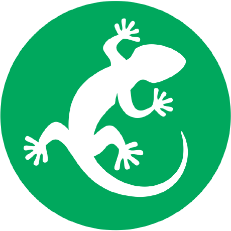
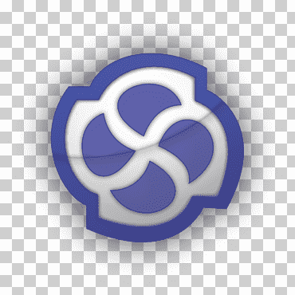
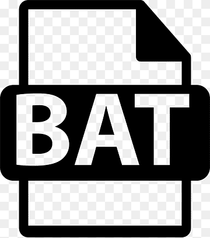

# Mallikarjuna00G

<table>
<tr>
<td>

- 👋 Hi, I’m @Mallikarjuna00G

- 👀 I’m interested in learning several programming languages be it target to any stream.

- Currently interested in `Java` and learning too.

I'm a self-taught passionate (beginner-level) developer from India 🇮🇳

</td>
<td>

- 🙏🏼 ನಮಸ್ಕಾರಗಳು 🙏🏼, ನಾನು ಮಲ್ಲಿಕಾರ್ಜುನ 🧔.  

- ನಿಪುಣನಲ್ಲದಿದ್ದರೂ, ಗಣಕಯಂತ್ರದ 🖥️ ಹಲವು ಭಾಷೆಗಳಲ್ಲಿ ಆಸಕ್ತಿಯುಳ್ಳವನಾಗಿದ್ದೇನೆ.

- ಸದ್ಯಕ್ಕೆ ನಾನು `ಜಾವಾ` ಕಲಿಯುತ್ತಿದ್ದೇನೆ ಮತ್ತು ಅದರಲ್ಲಿ ಆಸಕ್ತಿ ಹೊಂದಿದ್ದೇನೆ.

ಭಾರತ 🇮🇳 ಮೂಲದ ಸ್ವಯಂ-ಅಧ್ಯಯನ ಮಾಡುತ್ತಿರುವ ಉತ್ಸಾಹಿ ಅಭಿವರ್ಧಕನು ನಾನು 😊.
</td>
</tr>
</table>

## Social profiles
-  LinkedIn: [Mallikarjuna00G](https://www.linkedin.com/in/mallikarjuna00g/)
-  FreeCodeCamp: [Mallikarjuna00G](https://www.freecodecamp.org/Mallikarjuna00G)

## Github stats

|||
|---|---|
|  |  |

## Programming languages and tools

Programming languages and tools I went through atleast once and still have atleast smallest level of hope and trust that I can recall them well.

**Note:** In almost all of them I would rate myself 4 or 5 out of 10.

|Icon|Name|Comments|
|---|---|---|
||MS VS code||
||Bash||
||Git||
||C||
||C++||
||Python||
||Markdown||
||HTML5||
||CSS3||
||JavaScript||
||Java||
||Kotlin||
||Jupyter||
||Vector Canalyzer||
||CAPL (Communication Access Programming Language)||
||VectorCAST||
||MISRA C||
||CAN (Controlled Area Network)||
||Codebeamer||
||Enterprise Architect||
||LDRA||
||Meld|
||Teraterm||
||Windows Batch Scripting||
||Powershell||
||Matlab||
||Cmake||
||Embedded C||
||Github||
||JSON||
||VIM editor||

### References:

- Icons: <https://devicon.dev/>
