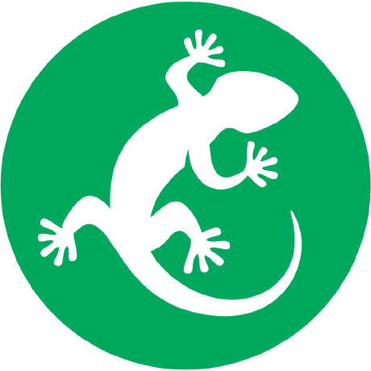
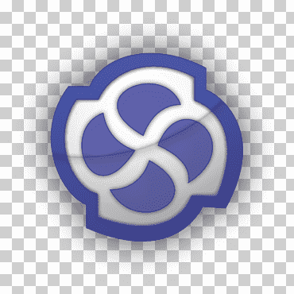
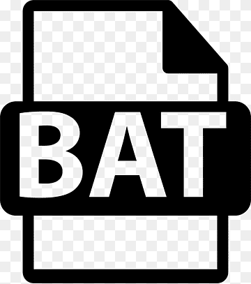

# Mallikarjuna00G

<table>
<tr>
<td>

- 👋 Hi, I’m @Mallikarjuna00G

- 👀 I’m interested in learning several programming languages be it target to any stream.

- Currently interested in `C++` and learning too.

I'm a self-taught passionate (beginner-level) developer from India 🇮🇳

</td>
<td>

- 🙏🏼 ನಮಸ್ಕಾರಗಳು 🙏🏼, ನಾನು ಮಲ್ಲಿಕಾರ್ಜುನ 🧔.  

- ನಿಪುಣನಲ್ಲದಿದ್ದರೂ, ಗಣಕಯಂತ್ರದ 🖥️ ಹಲವು ಭಾಷೆಗಳಲ್ಲಿ ಆಸಕ್ತಿಯುಳ್ಳವನಾಗಿದ್ದೇನೆ.

- ಸದ್ಯಕ್ಕೆ ನಾನು `C++` ಕಲಿಯುತ್ತಿದ್ದೇನೆ ಮತ್ತು ಅದರಲ್ಲಿ ಆಸಕ್ತಿ ಹೊಂದಿದ್ದೇನೆ.

ಭಾರತ 🇮🇳 ಮೂಲದ ಸ್ವಯಂ-ಅಧ್ಯಯನ ಮಾಡುತ್ತಿರುವ ಉತ್ಸಾಹಿ ಅಭಿವರ್ಧಕನು ನಾನು 😊.
</td>
</tr>
</table>

## Social profiles
-  LinkedIn: [Mallikarjuna00G](https://www.linkedin.com/in/mallikarjuna00g/)
-  FreeCodeCamp: [Mallikarjuna00G](https://www.freecodecamp.org/Mallikarjuna00G)

## Programming languages and tools

Programming languages and tools I went through atleast once and still have atleast smallest level of hope and trust that I can recall them well.

**Note:** In almost all of them I would rate myself 4 or 5 out of 10.

  <!-- MS VS code -->
  &nbsp;
  <!-- Bash -->
  &nbsp;
  <!-- Git -->
  &nbsp;
  <!-- C -->
  &nbsp;
  <!-- C++ -->
  &nbsp;
  <!-- Python -->
  &nbsp;
  <!-- Markdown -->
  &nbsp;
  <!-- HTML5 -->
  &nbsp;
  <!-- CSS3 -->
  &nbsp;
  <!-- JavaScript -->
  &nbsp;
  <!-- Java -->
  &nbsp;
  <!-- Kotlin -->
  &nbsp;
  <!-- Jupyter -->
  &nbsp;
  <!-- Vector Canalyzer -->
  &nbsp;
  <!-- CAPL -->
  &nbsp;
  <!-- VectorCAST -->
  &nbsp;
  <!-- MISRA C -->
  &nbsp;
  <!-- CAN -->
  &nbsp;
  <!-- Codebeamer -->
  &nbsp;
  <!-- Enterprise Architect -->
  &nbsp;
  <!-- LDRA -->
  &nbsp;
  <!-- Meld -->
  &nbsp;
  <!-- Teraterm -->
  &nbsp;
  <!-- Windows Batch Scripting -->
  &nbsp;
  <!-- Powershell -->
  &nbsp;
  <!-- Matlab -->
  &nbsp;
  <!-- Cmake -->
  &nbsp;
  <!-- Embedded C -->
  &nbsp;
  <!-- Github -->
  &nbsp;
  <!-- JSON -->
  &nbsp;
  <!-- VIM editor -->
  &nbsp;
  <!-- SimulIDE -->
  &nbsp;
  <!-- Arduino IDE -->
  &nbsp;

### References:

- Icons: <https://devicon.dev/>
